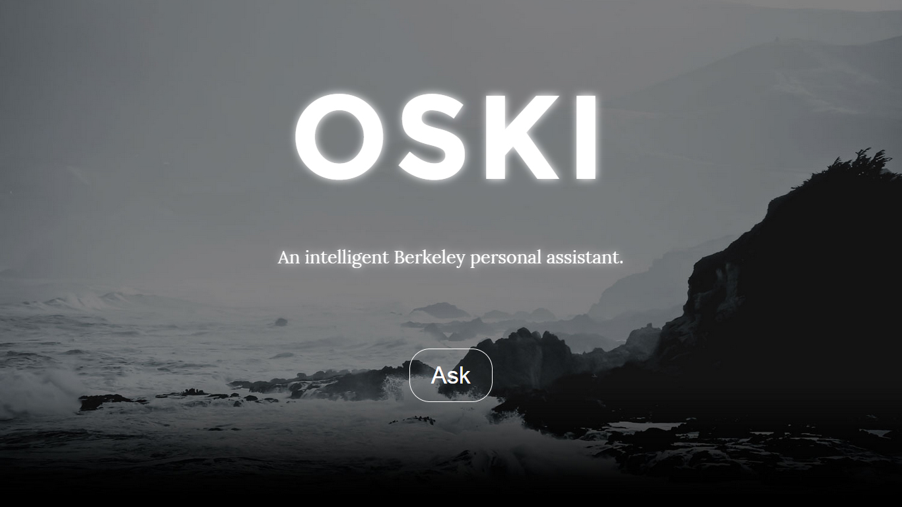

<html>
<body>

<h1> Oski </h1>

<h5>
Siri like voice recognition and processing unit for UC Berkeley students.
</h5>

<h5>
Requirements:
</h5>
 
SpeechRecognition
 
PyAudio
 

Project by Kurush Dubash and Hassaan Shakeel

</body>
</html>